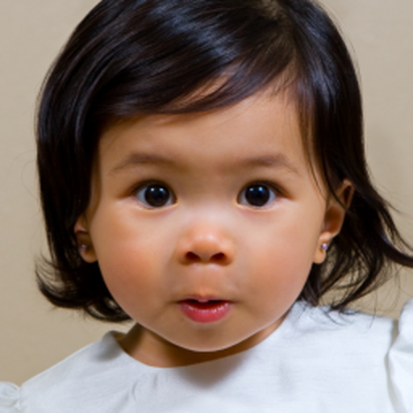
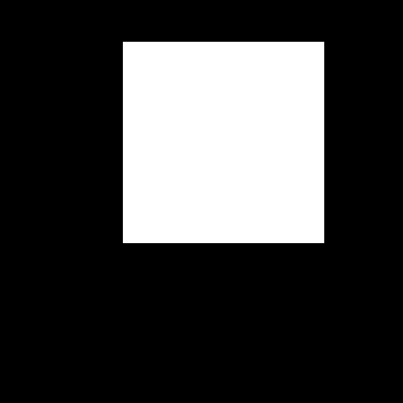

PSLD (Posterior Sampling using Latent Diffusion) inpainting for diffuser pipeline.


## Example

``` python
from psld.inpainting_pipeline import StableDiffusionInpaintPSLDPipeline
import torch
import numpy as np
from PIL import Image
import random

seed = 42
torch.manual_seed(seed)
np.random.seed(seed)
random.seed(seed)
torch.cuda.manual_seed(seed)

pretrained_p = 'runwayml/stable-diffusion-v1-5'
pipeline = StableDiffusionInpaintPSLDPipeline.from_pretrained(
    pretrained_p,
    torch_dtype=torch.float32,
    use_safetensors=True,
    requires_safety_checker=False,
)
pipeline = pipeline.to("cuda")

gamma = 1e-2
omega = 1e-1
prompt = ''
init_image = Image.open('workspace/inpaint_exp.png').convert('RGB')
mask = Image.open('workspace/inpaint_exp_mask.png').convert('L')

new_image = pipeline(prompt=prompt, image=init_image, mask_image=mask, enable_psld=True, gamma=gamma, omega=omega).images[0]
new_image.save('local_tst.jpg')
```

<table>
  <thead>
    <tr>
      <th align="center" width="33%">Input</th>
      <th align="center" width="33%">Mask</th>
      <th align="center" width="33%">Result</th>
    </tr>
  </thead>
  <tbody>
    <tr>
      <td align="center" >
        <a href="workspace/inpaint_exp.png">
          
        </a>
      </td>
      <td align="center">
        <a href="workspace/inpaint_exp_mask.png">
          
        </a>
      </td>
      <td align="center" >
        <a href="https://github.com/dmMaze/psld_diffusers/assets/51270320/7db67b00-cf80-4a1e-ad2a-2328f8886768">
          
        </a>
      </td>
    </tr>
  </tbody>
</table>

* Only inpainting is implemented
* Reduce num_inference_steps and scale gamma & omega accordingly could (not always) achieve similar results.
* Requires at least 18 GB VRAM for 512x512

## Reference
https://github.com/LituRout/PSLD
